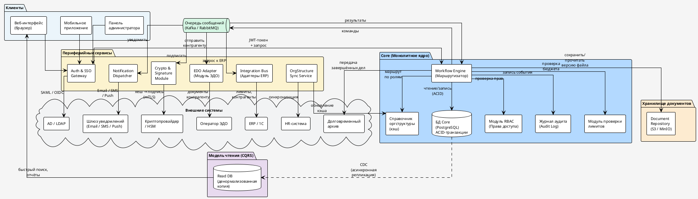

## 4. Архитектура

### 4.1. Декомпозиция на компоненты/сервисы и их обязанности

#### Общий подход

Система строится по гибридной архитектуре: ядро (Core) в монолитном стиле для обеспечения консистентности согласований, но с выделением периферийных микросервисов для интеграции с внешним миром и выполнения ресурсоёмких задач. Такой подход позволяет соблюсти NFR-требования (юридическая значимость, атомарность операций) и обеспечить гибкость интеграций.

---

#### Диаграмма компонентов

## 4.1. Компоненты системы

| № | Компонент | Назначение (простыми словами) | Кто пользуется (роль из CONOPS) | Ключевые взаимодействия |
|---|-----------|-------------------------------|--------------------------------|------------------------|
| 1 | **Core Workflow Engine (Маршрутизатор)** | Сердце системы. Управляет жизненным циклом документа: хранит состояния процессов, обеспечивает атомарность переходов по маршрутам («создан → визирование → подпись → подписан»). Проверяет права доступа, фиксирует каждое действие в Журнале аудита. Каждый переход — одна транзакция в БД: если что-то упало, откатывается всё. Документ не может «потеряться» между шагами. | Все роли (через интерфейс) | БД Core (ACID-транзакции); Auth Gateway (проверка токена); Audit Log (запись событий); Document Repository (файлы); очередь сообщений (команды периферии) |
| 2 | **Document Repository (Хранилище документов)** | Blob-хранилище с версионностью (S3-совместимое: MinIO или Ceph). Хранит все версии файлов (договоры, сканы, служебки). Каждая версия **неизменяема** (immutable) — при правке создаётся новая версия, старая остаётся навсегда. Включена WORM-политика (Write Once Read Many — «записал один раз, читай сколько угодно»): удалить версию нельзя ни программно, ни вручную. Файлы зашифрованы в хранилище (AES-256). Поддерживает дедупликацию: одинаковые файлы хранятся один раз. | Инициатор, Юрист, Согласующий (загружают / скачивают файлы) | Core (получает файлы по запросу после проверки прав); Долговременный архив (передача завершённых дел); антивирусная проверка при загрузке |
| 3 | **Auth & SSO Gateway (Шлюз аутентификации)** | «Проходная» системы. Все запросы от браузеров и мобильных приложений проходят через этот шлюз. Проверяет JWT-токены (цифровой «пропуск» с ролями и сроком действия), проксирует запросы в Core. Интегрируется с корпоративным каталогом (Active Directory / LDAP) по протоколу SAML или OIDC для единого входа (SSO). При недоступности AD — Администратор может включить ручную аутентификацию. | Все роли (при входе в систему); Администратор (при ручной аутентификации в режиме деградации) | Клиенты (принимает трафик); Identity Provider — Keycloak / ADFS (проверка учётных данных); Core (проксирует запросы с токеном) |
| 4 | **OrgStructure Sync Service (Синхронизация оргструктуры)** | Потребитель данных из HR-систем. Периодически (настраиваемый интервал, по умолчанию раз в сутки) выгружает актуальную оргструктуру: сотрудники, должности, руководители, заместители, замещения. Обновляет локальный кэш в Core (Справочник оргструктуры). Валидирует целостность иерархии (нет «висящих» узлов). Если HR-система недоступна — Core работает по последней кэшированной копии. | Автоматический процесс (нет прямого пользователя) | API HR-системы (1С:ЗУП, SAP SuccessFactors и т.д.); кэш оргструктуры в Core; валидация целостности иерархии |
| 5 | **Notification Dispatcher (Диспетчер уведомлений)** | Асинхронная отправка уведомлений. Получает события из Core через очередь сообщений («уведомить Петрову о новой задаче») и рассылает по нужному каналу: Email, SMS, Push в мобильное приложение, Telegram/Slack. Работает **асинхронно** — если почтовый сервер «лёг», сообщения копятся в очереди и отправятся при восстановлении. Сглаживает пиковую нагрузку на внешние сервисы. | Все роли (получают уведомления) | Очередь сообщений — Kafka / RabbitMQ (читает команды); API внешних почтовых сервисов / SMS-провайдеров / Push-сервисов |
| 6 | **Crypto & Signature Module (Крипто-модуль)** | Юридически значимые операции с электронной подписью. Когда Согласующий нажимает «Подписать», модуль: (а) считает хеш файла (SHA-256); (б) проверяет сертификат подписанта через OCSP; (в) отправляет хеш в HSM (аппаратный модуль безопасности); (г) получает подпись и метку времени (TSP). **Закрытый ключ никогда не покидает HSM** — даже Crypto Module его не видит. Связь защищена взаимным mTLS (двусторонняя проверка сертификатов). Вызывается **синхронно** — подписание должно завершиться до того, как пользователь увидит результат. | Согласующий (при подписании КЭП/УНЭП); Юрист (при проверке подписи в сценарии аудита) | Core (получает команду «подписать документ ID»); HSM / криптопровайдер (формирование подписи, OCSP, TSP); возвращает в Core файл с подписью |
| 7 | **Integration Bus / Adapters (Шина интеграций)** | Адаптеры для внешних учётных систем. Обеспечивает связь с: ERP (проверка бюджетных лимитов), CRM (данные контрагентов), банк-клиентом (отправка платежей). Преобразует протоколы и данные из формата платформы в формат внешней системы (REST/SOAP) и обратно. Работает через очередь — если ERP «упала», запросы копятся и обработаются при восстановлении. | Бухгалтер (косвенно — при проверке лимитов); Инициатор (косвенно — при проверке контрагента) | Очередь сообщений (получает запросы от Core); API внешних систем — ERP/1С, CRM, банк-клиент (REST/SOAP); возвращает результаты в очередь |
| 8 | **EDO Adapter (Модуль ЭДО)** | Обмен юридически значимыми документами с контрагентами. Отправляет подписанные документы через внешнего оператора ЭДО (роуминг) и принимает входящие документы с встречной КЭП. Проверяет квитанции о доставке, обрабатывает протоколы разногласий. Работает через очередь сообщений. | Контрагент (косвенно); Инициатор (получает статус обмена) | Очередь сообщений (получает команды от Core); API оператора ЭДО (отправка/приём документов, квитанции); Core (возвращает результаты) |
| 9 | **Admin & Config Panel (Панель администратора)** | Настройка системы. Интерфейс для Администратора: визуальный дизайнер маршрутов (BPMN), управление шаблонами документов, ролями, правами доступа (RBAC), правилами замещения, параметрами SLA. Не влияет на выполнение процессов напрямую — только изменяет конфигурацию, которую Core читает при следующем запуске маршрута. | Администратор | БД Core (конфигурационные таблицы — чтение/запись) |
| 10 | **БД Core (PostgreSQL)** | Главная база данных системы (РСУБД). Хранит: карточки документов, текущие статусы, задачи, связи между задачами, пользователей, настройки маршрутов, журнал аудита (криптографически связанные записи). Все операции записи — через транзакции ACID (атомарность: либо всё записалось, либо ничего). PostgreSQL / Oracle. **Ни один компонент, кроме Core, не обращается к этой БД напрямую.** | Только Core Workflow Engine (прямой доступ) | Core (единственный потребитель); Read DB (асинхронная репликация через CDC) |
| 11 | **Read DB (Модель чтения, CQRS)** | Денормализованная копия данных, оптимизированная для быстрого поиска и отчётов. Обновляется **асинхронно** из основной БД через CDC (Change Data Capture — механизм отслеживания изменений). Задержка — секунды. Используется для: реестра документов, полнотекстового поиска, аналитики. Может быть реализована как денормализованные таблицы в PostgreSQL или Elasticsearch. **Для критичных данных** («Мои задачи», только что созданный документ) — читается основная БД, а не реплика. | Все роли (при поиске и просмотре реестров) | Основная БД Core (CDC-репликация — источник данных); веб-интерфейс (быстрые запросы на чтение) |
| 12 | **Очередь сообщений (Kafka / RabbitMQ)** | Транспорт между Core и периферийными сервисами. Core кладёт команды («уведомить», «подписать», «проверить лимит», «отправить в ЭДО»), адаптеры забирают и выполняют. Результаты возвращаются обратно через очередь. Выступает буфером при сбоях: если внешняя система недоступна, сообщения копятся и обрабатываются при восстановлении. Гарантирует «at least once» доставку (хотя бы одна доставка). | Автоматический процесс (нет прямого пользователя) | Core (отправляет команды); все периферийные сервисы (получают команды, возвращают результаты) |
| 13 | **Веб-интерфейс (браузер)** | Основной клиент для пользователей. SPA-приложение (Single Page Application), работающее в браузере. Через него Инициатор создаёт документы, Согласующий утверждает, Юрист визирует, Бухгалтер проверяет реквизиты. Все запросы идут через Auth Gateway. | Инициатор, Согласующий, Юрист, Бухгалтер | Auth & SSO Gateway (все запросы); Read DB (быстрый поиск) |
| 14 | **Мобильное приложение** | Клиент для работы вне офиса. Позволяет просматривать документы (PDF), согласовывать, подписывать УНЭП через SMS-код. Поддерживает оффлайн-режим: решение сохраняется локально и синхронизируется при восстановлении связи. | Согласующий (мобильное согласование), Инициатор (создание служебной записки с фото) | Auth & SSO Gateway (все запросы); Core (синхронизация при восстановлении связи) |

### 4.2. Ключевые архитектурные решения (с trade-off обоснованием)

#### Решение 1. Монолитное ядро (Core Workflow Engine) вместо распределённой оркестрации микросервисов

**Контекст:**
Управление маршрутами согласования требует строгой согласованности данных и атомарности переходов. Нельзя допустить ситуации, когда документ прошёл один шаг, а второй «потерялся» из-за сетевой проблемы.

**Решение:**
Ядро системы строится как монолит (или «модульный монолит») с единой кодовой базой и транзакционной БД (ACID). Все операции по изменению статуса документа (согласование, отклонение, подписание) выполняются в рамках одной транзакции.

**Trade-off (компромиссы):**

| Плюсы | Минусы |
|-------|--------|
| **Консистентность** — гарантируется, что состояние процесса не будет частично обновлено. Это критично для юридической значимости (нельзя подтвердить подпись, не записав это в аудит). | **Масштабирование** — монолит сложнее горизонтально масштабировать под разные нагрузки (например, отдельно масштабировать подсистему подписания и подсистему чтения архивов). |
| **Простота разработки** — легче писать и отлаживать бизнес-логику, чем распределённые транзакции (Saga). | **Технологическая связанность** — изменение в одной части (например, в модуле расчёта лимитов) теоретически может дестабилизировать весь процесс согласования. |
| **Производительность** — нет накладных расходов на сетевые вызовы между микросервисами внутри ядра. | **«Тяжёлый» деплой** — обновление любой функции требует перезапуска всего приложения. |

**Вывод:**
Выбираем консистентность и надёжность в ущерб гибкости масштабирования, так как для Enterprise-СЭД это важнее.

**Привязка к NFR:** NFR-3 (доступность), NFR-5 (целостность аудита).
**Привязка к компонентам (таблица 4.1):** №1 (Core Workflow Engine), №9 (Database).

---

#### Решение 2. CQRS (Command Query Responsibility Segregation) для разделения операций записи и чтения

**Контекст:**
В системе два типа операций:

- **Команды (запись):** согласование, подписание, отклонение. Их немного, но они критичны и требуют строгих проверок.
- **Запросы (чтение):** просмотр ленты задач, поиск документов, построение отчётов. Их много, и они должны быть быстрыми.

Если и запись, и чтение работают с одной базой, тяжёлый поисковый запрос («все договоры за 2024 год с суммой > 1 млн») может замедлить критическую операцию подписания.

**Решение:**
Разделяем модель данных для записи и чтения:

- **Запись (Command side):** Core работает с нормализованной БД (3НФ) для гарантии целостности.
- **Чтение (Query side):** данные асинхронно реплицируются в специализированное хранилище (денормализованные таблицы, возможно Elasticsearch) для быстрого поиска и фильтрации.

**Важно:** раздел «Мои задачи» (текущие задачи пользователя) читает данные **напрямую из командной БД** — здесь задержка недопустима. «Реестр документов» и «Поиск» работают с репликой.

**Trade-off (компромиссы):**

| Плюсы | Минусы |
|-------|--------|
| **Производительность** — тяжёлые поисковые запросы не нагружают основную БД и не блокируют критические операции согласования. | **Согласованность (Eventual Consistency)** — пользователь может не сразу увидеть только что подписанный документ в поиске (задержка в секунды/минуты). |
| **Масштабирование** — можно независимо масштабировать количество реплик для чтения. | **Сложность** — нужно поддерживать механизм репликации данных (например, через Change Data Capture или событийную шину). |
| **Отказоустойчивость** — если упадёт база для чтения (поиск), система всё ещё сможет принимать команды (согласовывать документы). | **Двойное хранение** — часть данных дублируется. |

**Вывод:**
Сознательно идём на компромисс с eventual consistency, так как для сценариев «найти документ за прошлый год» допустима небольшая задержка. Для критичных операций (только что созданный документ) пользователь всегда видит его в разделе «Мои задачи», который читает данные напрямую из командной БД.

**Привязка к NFR:** NFR-1 (отклик ≤ 2 сек в p95), NFR-7 (масштабируемость).
**Привязка к компонентам (таблица 4.1):** №9 (Database — command side), №11 (Read DB — query side).

---

#### Решение 3. Блочное (версионное) хранилище документов с неизменяемостью (Immutable Storage)

**Контекст:**
NFR-требование — юридическая значимость и аудит. Нельзя позволить перезаписывать или удалять файлы.

**Решение:**
В качестве хранилища документов используется объектное хранилище (S3-совместимое, например MinIO или Ceph) с включённой версионностью и WORM-политикой (Write Once Read Many). При каждом изменении файла сохраняется новая версия. Удаление версий запрещено на уровне политик. Метаданные о версиях хранятся в основной БД (ссылка на версию).

**Trade-off (компромиссы):**

| Плюсы | Минусы |
|-------|--------|
| **Юридическая чистота** — полная история изменений доступна для аудита. Невозможно удалить компрометирующую или ошибочную версию. | **Рост объёма данных** — каждая правка создаёт новую копию файла (или блока). Это требует больших дисковых мощностей. |
| **Надёжность** — S3-хранилища устойчивы к потерям данных. | **Сложность управления жизненным циклом** — нельзя просто так удалить старые версии (из-за WORM-политики). Приходится вводить процедуры «выгрузки в холодный архив» (например, в Glacier) для версий старше 5 лет. |
| **Дедупликация** — можно хранить только изменённые блоки (если поддерживается), экономя место. | **Производительность чтения списка версий** — при 100+ версиях одного документа загрузка списка может тормозить. |

**Вывод:**
Юридическая безопасность важнее экономии дискового пространства. Принимаем рост объёма данных как неизбежную плату за неотказуемость.

**Привязка к NFR:** NFR-5 (целостность аудита), NFR-6 (шифрование), NFR-11 (архивация).
**Привязка к компонентам (таблица 4.1):** №2 (Document Repository).

---

#### Решение 4. Асинхронная коммуникация с внешними сервисами через очереди и паттерн «Сага» для распределённых транзакций

**Контекст:**
Интеграции с внешними системами (ERP, банк) ненадёжны. Они могут падать, долго отвечать или выдавать ошибки. При этом нужно выполнять распределённые транзакции (например: «зарезервировать бюджет в ERP» → «провести платёж в банке»).

**Решение:**
Все взаимодействия с внешними сервисами выносятся в асинхронную шину (Kafka / RabbitMQ) и обрабатываются через паттерн Saga (хореография):

1. Core создаёт задачу для внешней интеграции и кладёт команду в очередь.
2. Адаптер забирает команду, выполняет запрос к внешней системе.
3. Результат (успех / ошибка) кладётся обратно в очередь.
4. Core получает результат и либо продолжает процесс (следующий шаг саги), либо запускает компенсирующую транзакцию (откат).

**Trade-off (компромиссы):**

| Плюсы | Минусы |
|-------|--------|
| **Устойчивость к сбоям** — очереди выступают буфером. Если внешний сервис упал, сообщения копятся и обрабатываются при его восстановлении. | **Сложность** — саги сложны в разработке и отладке. Нужно предусматривать компенсирующие действия (откаты) на каждый шаг. |
| **Нет блокировки** — основной поток не ждёт ответа от медленного банка. Пользователь получает статус «Передано в банк», а система сама дождётся ответа. | **Идемпотентность** — внешние системы и адаптеры должны корректно обрабатывать повторные сообщения (дубликаты). |
| **Сглаживание пиков** — очередь защищает внешние системы от пиковых нагрузок со стороны платформы. | **Согласованность** — между шагами саги система находится в промежуточном, несогласованном состоянии (например, бюджет зарезервирован, но платёж ещё не прошёл). |

**Вывод:**
Сложность реализации саги оправдана, так как мы не можем допустить, чтобы сбой банка «ронял» весь процесс согласования. Асинхронность повышает отказоустойчивость системы.

**Привязка к NFR:** NFR-4 (деградация ≤ 30 сек), NFR-8 (RPO/RTO).
**Привязка к компонентам (таблица 4.1):** №5 (Notification Dispatcher), №7 (Integration Bus), №8 (EDO Adapter).

---

#### Решение 5. Выделенный крипто-модуль (Crypto as a Service) с аппаратной поддержкой (HSM)

**Контекст:**
Операции с электронной подписью требуют высокой степени защиты и соответствия законодательству (ФСБ, ФСТЭК). Нельзя хранить ключи в коде приложения.

**Решение:**
Создаётся отдельный микросервис (Crypto Module), который работает как прослойка между Core и аппаратными крипто-модулями (HSM). Core отправляет команду: «Подписать документ ID сотрудника Иванова». Crypto Module:

1. Проверяет права сервиса (взаимный mTLS).
2. Идентифицирует сотрудника и получает указатель на его ключ в HSM.
3. Передаёт хеш документа в HSM для формирования подписи.
4. Никогда не имеет доступа к самому закрытому ключу в открытом виде.

**Trade-off (компромиссы):**

| Плюсы | Минусы |
|-------|--------|
| **Безопасность** — закрытые ключи физически не покидают HSM. Даже взлом Crypto Module не даст злоумышленнику ключи. | **Стоимость** — HSM — дорогое удовольствие (как само оборудование, так и его обслуживание). |
| **Соответствие регуляторам** — упрощает прохождение сертификации (аттестации) системы. | **Задержки (Latency)** — сетевой вызов к отдельному сервису + обращение к HSM добавляют несколько миллисекунд к операции подписания (обычно некритично). |
| **Масштабирование** — можно добавить несколько HSM или вынести подписание на отдельные мощные серверы. | **Сложность инфраструктуры** — появляется ещё одна точка отказа, которую нужно мониторить и реплицировать. |

**Вывод:**
Для системы, в которой КЭП имеет юридическую силу, аппаратная защита ключей — не опция, а необходимость. Стоимость HSM — это «страховка» от катастрофических последствий утечки ключей.

**Привязка к NFR:** NFR-2 (подпись ≤ 5 сек в p95), NFR-6 (шифрование).
**Привязка к компонентам (таблица 4.1):** №6 (Crypto & Signature Module).

---

#### Сводная таблица архитектурных решений

| № | Решение | Что получаем | Чем платим | Привязка к NFR | Компоненты (табл. 4.1) |
|---|---------|-------------|-----------|----------------|----------------------|
| 1 | Монолитное ядро | Атомарность операций, юридическая надёжность | Сложнее масштабировать, «тяжёлый» деплой | NFR-3, NFR-5 | №1, №9 |
| 2 | CQRS (разделение чтения/записи) | Быстрый поиск, независимое масштабирование чтения | Eventual consistency, сложность репликации | NFR-1, NFR-7 | №9, №11 |
| 3 | Immutable-хранилище (WORM) | Полная история версий, невозможность удаления | Рост объёма данных, миграция в холодный архив | NFR-5, NFR-6, NFR-11 | №2 |
| 4 | Асинхронная очередь + Saga | Устойчивость к сбоям внешних систем | Сложность Saga, промежуточные состояния | NFR-4, NFR-8 | №5, №7, №8 |
| 5 | Крипто-модуль + HSM | Безопасность ключей, соответствие регуляторам | Стоимость HSM, дополнительная точка отказа | NFR-2, NFR-6 | №6 |
