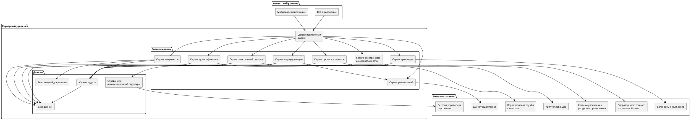
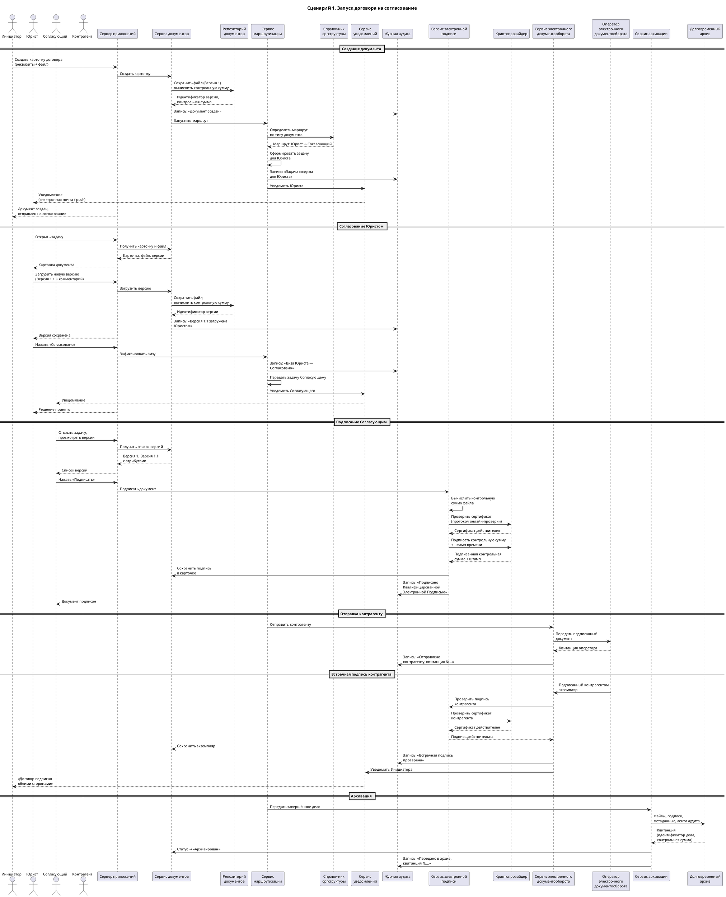
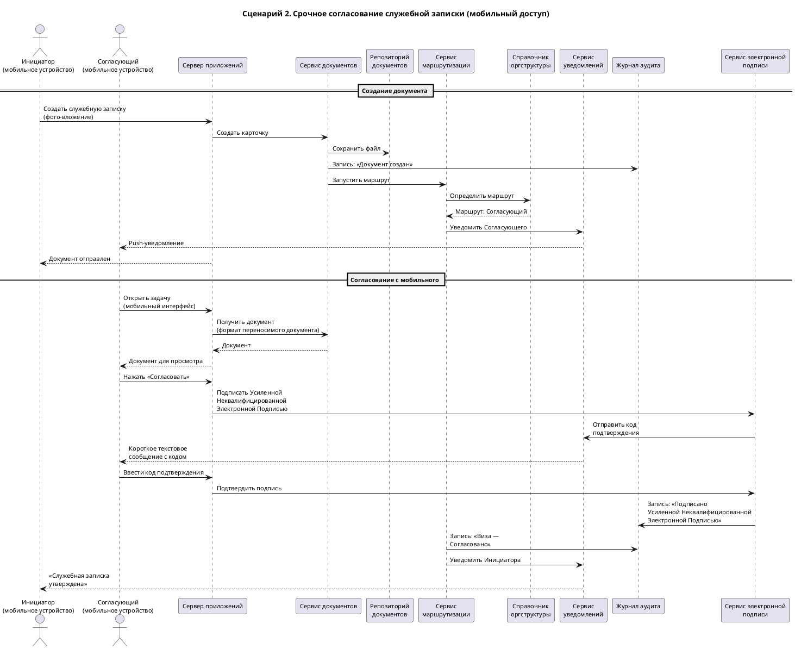
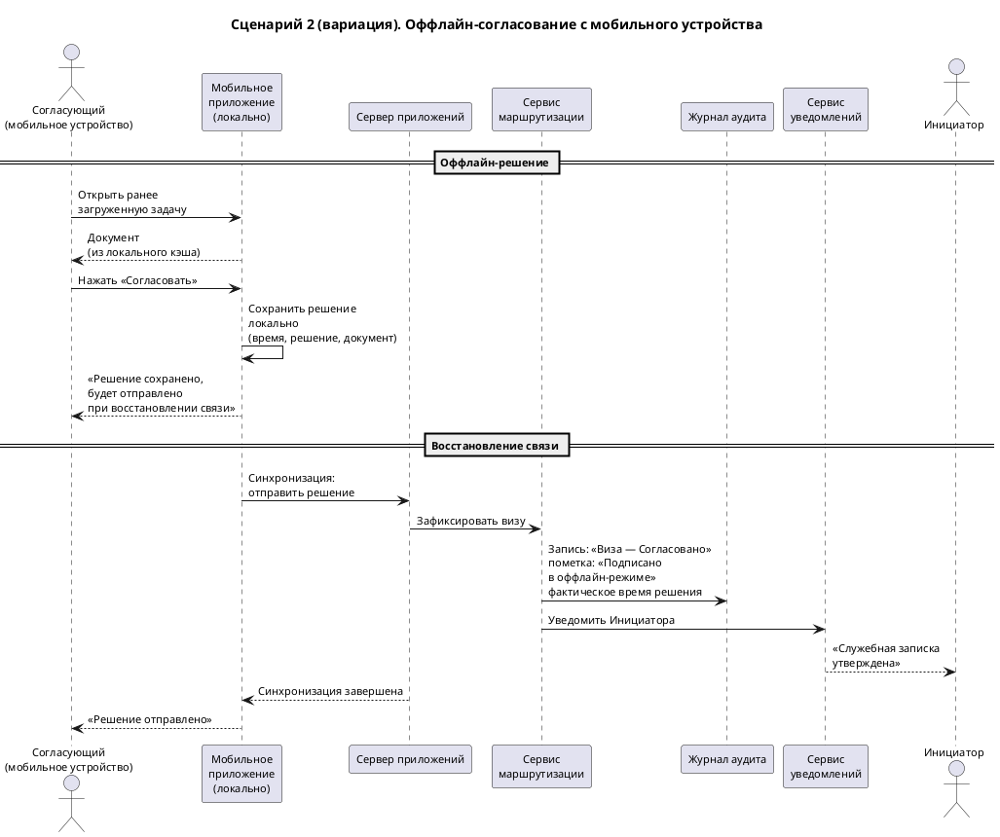
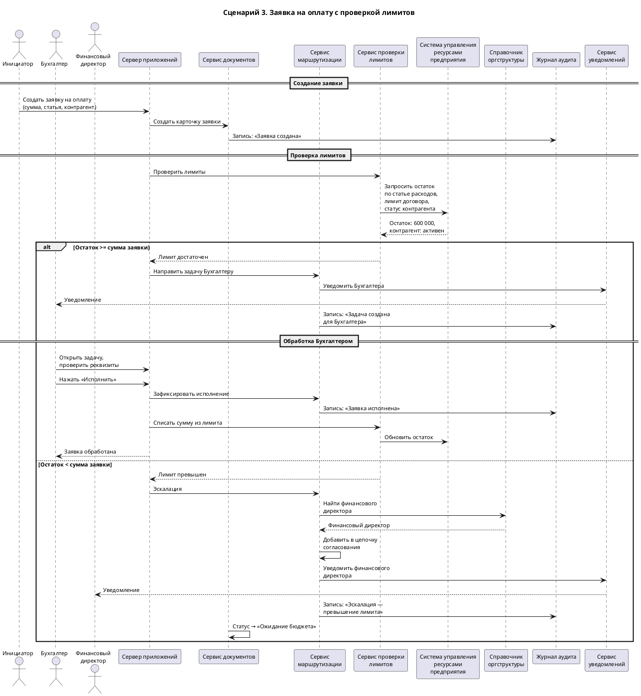
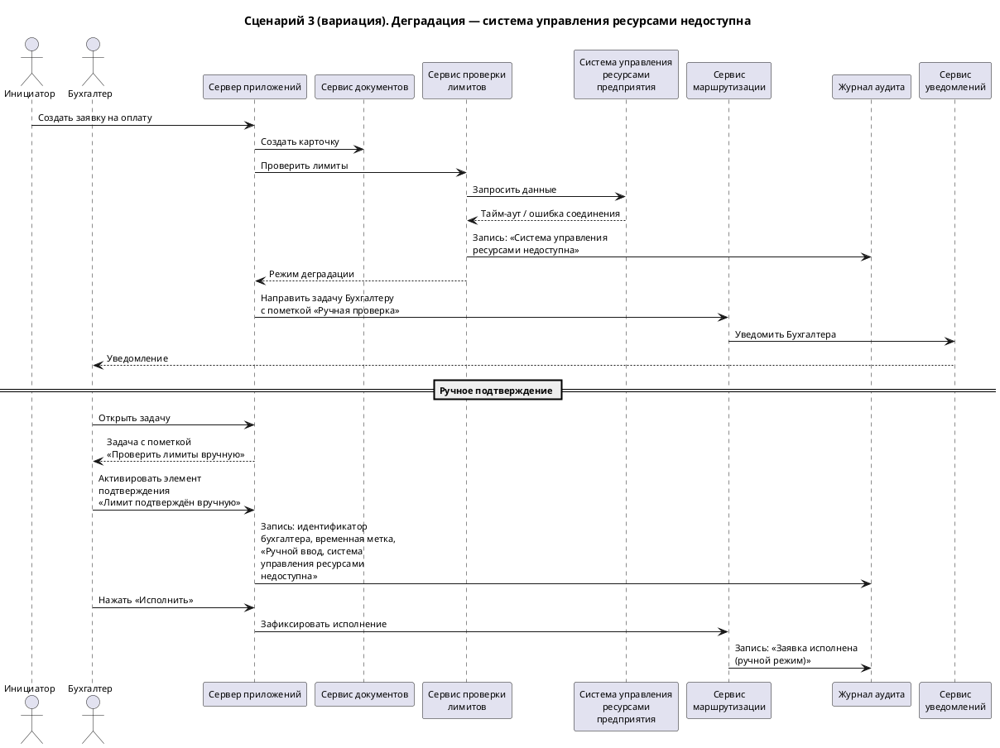
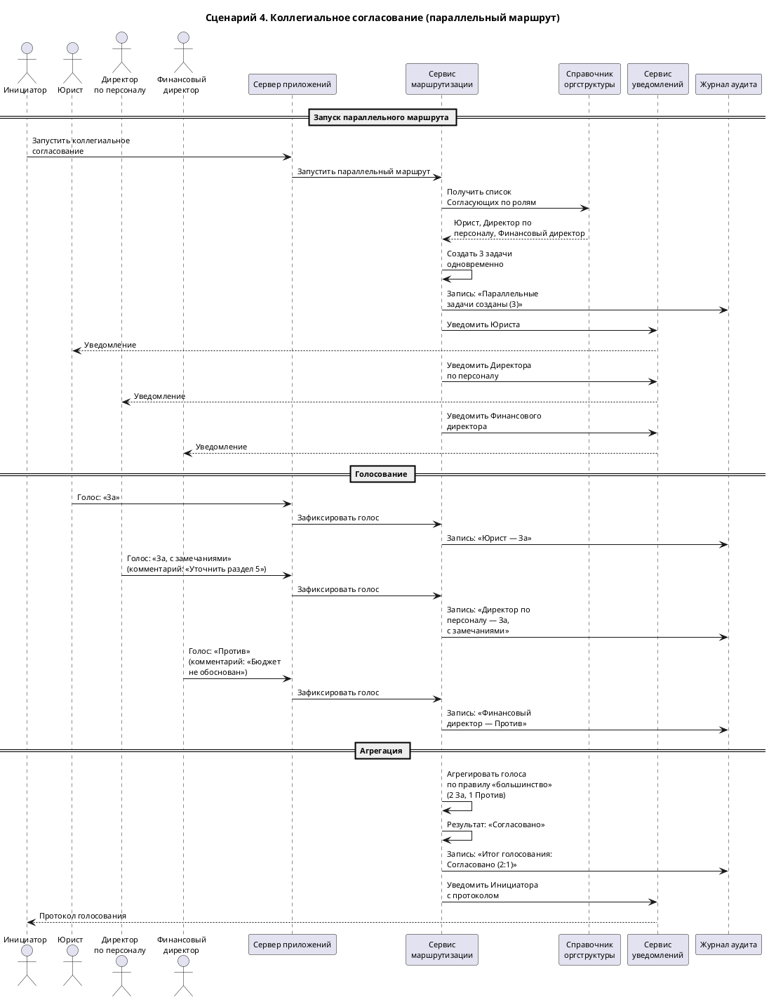
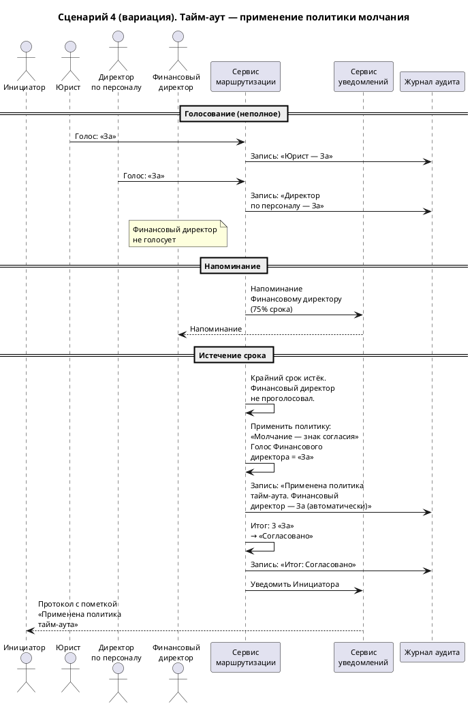
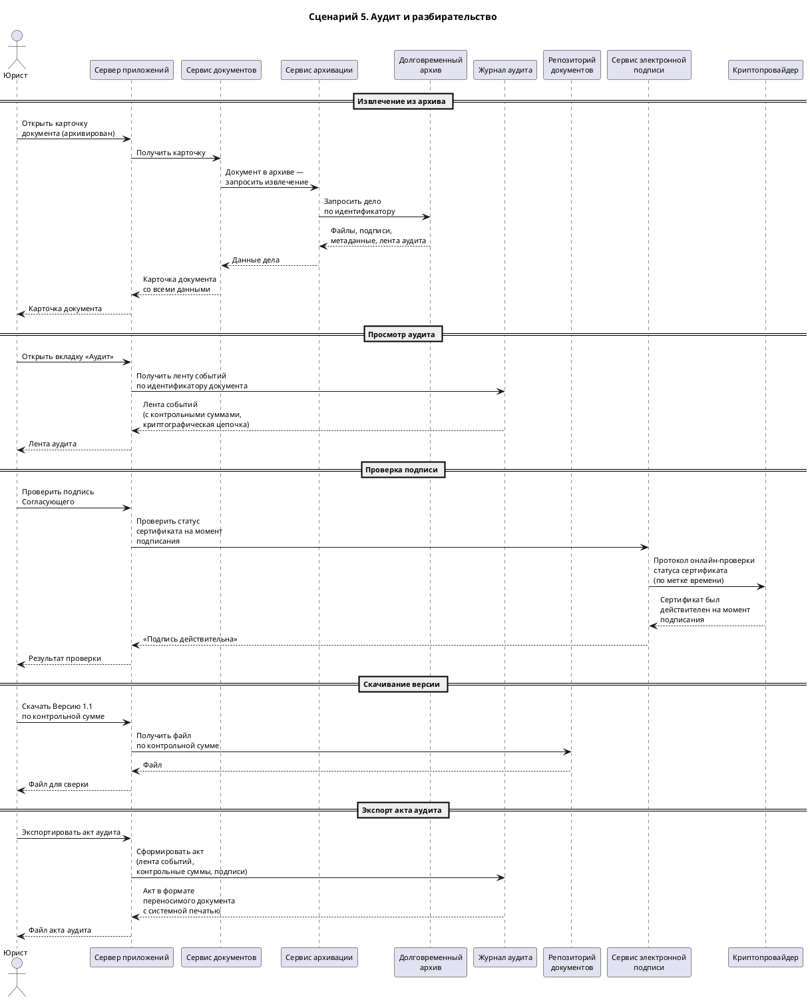

## 4. Архитектура

### 4.1 Декомпозиция на компоненты и обязанности

#### Перечень компонентов

| Компонент | Обязанности |
|---|---|
| **Веб-приложение** | Пользовательский интерфейс для работы через браузер. Отображение карточек документов, задач, версий, журнала аудита. Отправка запросов к серверу приложений. |
| **Мобильное приложение** | Пользовательский интерфейс для мобильных устройств (адаптивная веб-версия или нативное приложение). Просмотр документов, согласование, подписание Усиленной Неквалифицированной Электронной Подписью. Оффлайн-режим с локальным хранением решений. |
| **Сервер приложений (шлюз)** | Единая точка входа для клиентских приложений. Аутентификация и авторизация запросов по токену. Маршрутизация запросов к внутренним сервисам. |
| **Сервис документов** | Создание и хранение карточек документов. Управление атрибутами (тип, контрагент, сумма, статья расходов, статус). Взаимодействие с Репозиторием документов для файлов и версий. |
| **Репозиторий документов** | Хранение файлов всех версий. Вычисление и хранение контрольных сумм. Обнаружение конфликтов версий. |
| **Сервис маршрутизации** | Определение маршрута согласования по типу документа и шаблону. Формирование задач, передача задач между участниками. Контроль сроков, отправка напоминаний и эскалаций. Поддержка параллельных маршрутов и агрегации голосов. |
| **Сервис аутентификации** | Интеграция с корпоративной службой каталогов. Выдача и проверка токенов сессии. Режим ручной аутентификации при недоступности службы каталогов. |
| **Справочник организационной структуры** | Кэшированная база сотрудников, ролей, иерархии, замещений. Периодическая синхронизация с системой управления персоналом. Предоставление данных Сервису маршрутизации. |
| **Сервис электронной подписи** | Взаимодействие с криптопровайдером. Наложение Квалифицированной Электронной Подписи и Усиленной Неквалифицированной Электронной Подписи. Проверка статуса сертификата через протокол онлайн-проверки статуса сертификата. Управление очередью отложенного подписания. |
| **Сервис уведомлений** | Отправка уведомлений по электронной почте, push-уведомлений и коротких текстовых сообщений через внешний шлюз. Переключение на альтернативный канал при недоступности основного. |
| **Журнал аудита** | Запись всех значимых событий с криптографической цепочкой. Проверка целостности цепочки. Экспорт акта аудита. Защита от модификации и удаления. |
| **Сервис электронного документооборота** | Отправка подписанных документов контрагенту через внешнего оператора. Приём встречной подписи и протоколов разногласий. Управление очередью отправки при недоступности оператора. |
| **Сервис проверки лимитов** | Запрос бюджетных лимитов и статуса контрагента из системы управления ресурсами предприятия. Ручной режим при недоступности системы управления ресурсами. |
| **Сервис архивации** | Передача завершённых дел в долговременный архив. Проверка комплектности передаваемых данных. Получение квитанции от архива. Извлечение документов из архива по запросу. |
| **База данных** | Хранение карточек документов, задач, маршрутов, голосов, записей аудита, настроек ролей и шаблонов. |

---

#### Общая диаграмма компонентов

```plantuml
@startuml
skinparam componentStyle rectangle
skinparam defaultFontSize 11

package "Клиентский уровень" {
  [Веб-приложение] as WEB
  [Мобильное приложение] as MOB
}

package "Серверный уровень" {
  [Сервер приложений\n(шлюз)] as GW

  package "Бизнес-сервисы" {
    [Сервис документов] as DOC
    [Сервис маршрутизации] as WF
    [Сервис электронной подписи] as SIG
    [Сервис уведомлений] as NOTIF
    [Сервис проверки лимитов] as LIM
    [Сервис электронного\nдокументооборота] as EDO
    [Сервис архивации] as ARCH
    [Сервис аутентификации] as AUTH
  }

  package "Данные" {
    [База данных] as DB
    [Репозиторий документов] as REPO
    [Журнал аудита] as AUDIT
    [Справочник\nорганизационной структуры] as ORG
  }
}

package "Внешние системы" {
  [Корпоративная служба\nкаталогов] as LDAP
  [Система управления\nресурсами предприятия] as ERP
  [Система управления\nперсоналом] as HR
  [Криптопровайдер] as CRYPTO
  [Оператор электронного\nдокументооборота] as EDO_EXT
  [Шлюз уведомлений] as NOTIF_EXT
  [Долговременный архив] as ARCH_EXT
}

WEB --> GW
MOB --> GW

GW --> AUTH
GW --> DOC
GW --> WF
GW --> SIG
GW --> NOTIF
GW --> LIM
GW --> EDO
GW --> ARCH

DOC --> DB
DOC --> REPO
DOC --> AUDIT

WF --> DB
WF --> ORG
WF --> NOTIF
WF --> AUDIT

SIG --> CRYPTO
SIG --> AUDIT
SIG --> DB

NOTIF --> NOTIF_EXT

LIM --> ERP
LIM --> AUDIT

EDO --> EDO_EXT
EDO --> AUDIT

ARCH --> ARCH_EXT
ARCH --> AUDIT

AUTH --> LDAP
AUTH --> AUDIT
AUTH --> DB

ORG --> HR

AUDIT --> DB

@enduml
```

#### Сценарий 1 — Запуск договора на согласование

```plantuml
@startuml
skinparam defaultFontSize 11
title Сценарий 1. Запуск договора на согласование

actor "Инициатор" as INIT
actor "Юрист" as LAW
actor "Согласующий" as APPR
actor "Контрагент" as CONTR

participant "Сервер приложений" as GW
participant "Сервис документов" as DOC
participant "Репозиторий\nдокументов" as REPO
participant "Сервис\nмаршрутизации" as WF
participant "Справочник\nоргструктуры" as ORG
participant "Сервис\nуведомлений" as NOTIF
participant "Журнал аудита" as AUDIT
participant "Сервис электронной\nподписи" as SIG
participant "Криптопровайдер" as CRYPTO
participant "Сервис электронного\nдокументооборота" as EDO
participant "Оператор\nэлектронного\nдокументооборота" as EDO_EXT
participant "Сервис архивации" as ARCH
participant "Долговременный\nархив" as ARCH_EXT

== Создание документа ==

INIT -> GW : Создать карточку договора\n(реквизиты + файл)
GW -> DOC : Создать карточку
DOC -> REPO : Сохранить файл (Версия 1)\nвычислить контрольную сумму
REPO --> DOC : Идентификатор версии,\nконтрольная сумма
DOC -> AUDIT : Запись: «Документ создан»
DOC -> WF : Запустить маршрут
WF -> ORG : Определить маршрут\nпо типу документа
ORG --> WF : Маршрут: Юрист → Согласующий
WF -> WF : Сформировать задачу\nдля Юриста
WF -> AUDIT : Запись: «Задача создана\nдля Юриста»
WF -> NOTIF : Уведомить Юриста
NOTIF --> LAW : Уведомление\n(электронная почта / push)
GW --> INIT : Документ создан,\nотправлен на согласование

== Согласование Юристом ==

LAW -> GW : Открыть задачу
GW -> DOC : Получить карточку и файл
DOC --> GW : Карточка, файл, версии
GW --> LAW : Карточка документа

LAW -> GW : Загрузить новую версию\n(Версия 1.1 + комментарий)
GW -> DOC : Загрузить версию
DOC -> REPO : Сохранить файл,\nвычислить контрольную сумму
REPO --> DOC : Идентификатор версии
DOC -> AUDIT : Запись: «Версия 1.1 загружена\nЮристом»
GW --> LAW : Версия сохранена

LAW -> GW : Нажать «Согласовано»
GW -> WF : Зафиксировать визу
WF -> AUDIT : Запись: «Виза Юриста —\nСогласовано»
WF -> WF : Передать задачу Согласующему
WF -> NOTIF : Уведомить Согласующего
NOTIF --> APPR : Уведомление
GW --> LAW : Решение принято

== Подписание Согласующим ==

APPR -> GW : Открыть задачу,\nпросмотреть версии
GW -> DOC : Получить список версий
DOC --> GW : Версия 1, Версия 1.1\nс атрибутами
GW --> APPR : Список версий

APPR -> GW : Нажать «Подписать»
GW -> SIG : Подписать документ
SIG -> SIG : Вычислить контрольную\nсумму файла
SIG -> CRYPTO : Проверить сертификат\n(протокол онлайн-проверки)
CRYPTO --> SIG : Сертификат действителен
SIG -> CRYPTO : Подписать контрольную сумму\n+ штамп времени
CRYPTO --> SIG : Подписанная контрольная\nсумма + штамп
SIG -> DOC : Сохранить подпись\nв карточке
SIG -> AUDIT : Запись: «Подписано\nКвалифицированной\nЭлектронной Подписью»
GW --> APPR : Документ подписан

== Отправка контрагенту ==

WF -> EDO : Отправить контрагенту
EDO -> EDO_EXT : Передать подписанный\nдокумент
EDO_EXT --> EDO : Квитанция оператора
EDO -> AUDIT : Запись: «Отправлено\nконтрагенту, квитанция №...»

== Встречная подпись контрагента ==

EDO_EXT -> EDO : Подписанный контрагентом\nэкземпляр
EDO -> SIG : Проверить подпись\nконтрагента
SIG -> CRYPTO : Проверить сертификат\nконтрагента
CRYPTO --> SIG : Сертификат действителен
SIG --> EDO : Подпись действительна
EDO -> DOC : Сохранить экземпляр
EDO -> AUDIT : Запись: «Встречная подпись\nпроверена»
EDO -> NOTIF : Уведомить Инициатора
NOTIF --> INIT : «Договор подписан\nобеими сторонами»

== Архивация ==

WF -> ARCH : Передать завершённое дело
ARCH -> ARCH_EXT : Файлы, подписи,\nметаданные, лента аудита
ARCH_EXT --> ARCH : Квитанция\n(идентификатор дела,\nконтрольная сумма)
ARCH -> DOC : Статус → «Архивирован»
ARCH -> AUDIT : Запись: «Передано в архив,\nквитанция №...»

@enduml
```

#### Сценарий 2 — Срочное согласование с мобильного устройства

```plantuml
@startuml
skinparam defaultFontSize 11
title Сценарий 2. Срочное согласование служебной записки (мобильный доступ)

actor "Инициатор\n(мобильное устройство)" as INIT
actor "Согласующий\n(мобильное устройство)" as APPR

participant "Сервер приложений" as GW
participant "Сервис документов" as DOC
participant "Репозиторий\nдокументов" as REPO
participant "Сервис\nмаршрутизации" as WF
participant "Справочник\nоргструктуры" as ORG
participant "Сервис\nуведомлений" as NOTIF
participant "Журнал аудита" as AUDIT
participant "Сервис электронной\nподписи" as SIG

== Создание документа ==

INIT -> GW : Создать служебную записку\n(фото-вложение)
GW -> DOC : Создать карточку
DOC -> REPO : Сохранить файл
DOC -> AUDIT : Запись: «Документ создан»
DOC -> WF : Запустить маршрут
WF -> ORG : Определить маршрут
ORG --> WF : Маршрут: Согласующий
WF -> NOTIF : Уведомить Согласующего
NOTIF --> APPR : Push-уведомление
GW --> INIT : Документ отправлен

== Согласование с мобильного ==

APPR -> GW : Открыть задачу\n(мобильный интерфейс)
GW -> DOC : Получить документ\n(формат переносимого документа)
DOC --> GW : Документ
GW --> APPR : Документ для просмотра

APPR -> GW : Нажать «Согласовать»
GW -> SIG : Подписать Усиленной\nНеквалифицированной\nЭлектронной Подписью
SIG -> NOTIF : Отправить код\nподтверждения
NOTIF --> APPR : Короткое текстовое\nсообщение с кодом
APPR -> GW : Ввести код подтверждения
GW -> SIG : Подтвердить подпись
SIG -> AUDIT : Запись: «Подписано\nУсиленной Неквалифицированной\nЭлектронной Подписью»
WF -> AUDIT : Запись: «Виза —\nСогласовано»

WF -> NOTIF : Уведомить Инициатора
NOTIF --> INIT : «Служебная записка\nутверждена»

@enduml
```

####  Сценарий 2 (вариация) — Оффлайн-режим

```plantuml
@startuml
skinparam defaultFontSize 11
title Сценарий 2 (вариация). Оффлайн-согласование с мобильного устройства

actor "Согласующий\n(мобильное устройство)" as APPR

participant "Мобильное\nприложение\n(локально)" as APP
participant "Сервер приложений" as GW
participant "Сервис\nмаршрутизации" as WF
participant "Журнал аудита" as AUDIT
participant "Сервис\nуведомлений" as NOTIF
actor "Инициатор" as INIT

== Оффлайн-решение ==

APPR -> APP : Открыть ранее\nзагруженную задачу
APP --> APPR : Документ\n(из локального кэша)
APPR -> APP : Нажать «Согласовать»
APP -> APP : Сохранить решение\nлокально\n(время, решение, документ)
APP --> APPR : «Решение сохранено,\nбудет отправлено\nпри восстановлении связи»

== Восстановление связи ==

APP -> GW : Синхронизация:\nотправить решение
GW -> WF : Зафиксировать визу
WF -> AUDIT : Запись: «Виза — Согласовано»\nпометка: «Подписано\nв оффлайн-режиме»\nфактическое время решения
WF -> NOTIF : Уведомить Инициатора
NOTIF --> INIT : «Служебная записка\nутверждена»
GW --> APP : Синхронизация завершена
APP --> APPR : «Решение отправлено»

@enduml
```

#### Сценарий 3 — Заявка на оплату

```plantuml
@startuml
skinparam defaultFontSize 11
title Сценарий 3. Заявка на оплату с проверкой лимитов

actor "Инициатор" as INIT
actor "Бухгалтер" as ACC
actor "Финансовый\nдиректор" as CFO

participant "Сервер приложений" as GW
participant "Сервис документов" as DOC
participant "Сервис\nмаршрутизации" as WF
participant "Сервис проверки\nлимитов" as LIM
participant "Система управления\nресурсами\nпредприятия" as ERP
participant "Справочник\nоргструктуры" as ORG
participant "Журнал аудита" as AUDIT
participant "Сервис\nуведомлений" as NOTIF

== Создание заявки ==

INIT -> GW : Создать заявку на оплату\n(сумма, статья, контрагент)
GW -> DOC : Создать карточку заявки
DOC -> AUDIT : Запись: «Заявка создана»

== Проверка лимитов ==

GW -> LIM : Проверить лимиты
LIM -> ERP : Запросить остаток\nпо статье расходов,\nлимит договора,\nстатус контрагента
ERP --> LIM : Остаток: 600 000,\nконтрагент: активен

alt Остаток >= сумма заявки

  LIM --> GW : Лимит достаточен
  GW -> WF : Направить задачу Бухгалтеру
  WF -> NOTIF : Уведомить Бухгалтера
  NOTIF --> ACC : Уведомление
  WF -> AUDIT : Запись: «Задача создана\nдля Бухгалтера»

  == Обработка Бухгалтером ==

  ACC -> GW : Открыть задачу,\nпроверить реквизиты
  ACC -> GW : Нажать «Исполнить»
  GW -> WF : Зафиксировать исполнение
  WF -> AUDIT : Запись: «Заявка исполнена»
  GW -> LIM : Списать сумму из лимита
  LIM -> ERP : Обновить остаток
  GW --> ACC : Заявка обработана

else Остаток < сумма заявки

  LIM --> GW : Лимит превышен
  GW -> WF : Эскалация
  WF -> ORG : Найти финансового\nдиректора
  ORG --> WF : Финансовый директор
  WF -> WF : Добавить в цепочку\nсогласования
  WF -> NOTIF : Уведомить финансового\nдиректора
  NOTIF --> CFO : Уведомление
  WF -> AUDIT : Запись: «Эскалация —\nпревышение лимита»
  DOC -> DOC : Статус → «Ожидание бюджета»

end

@enduml
```

####  Сценарий 3 (вариация) — Деградация при недоступности системы управления ресурсами

```plantuml
@startuml
skinparam defaultFontSize 11
title Сценарий 3 (вариация). Деградация — система управления ресурсами недоступна

actor "Инициатор" as INIT
actor "Бухгалтер" as ACC

participant "Сервер приложений" as GW
participant "Сервис документов" as DOC
participant "Сервис проверки\nлимитов" as LIM
participant "Система управления\nресурсами\nпредприятия" as ERP
participant "Сервис\nмаршрутизации" as WF
participant "Журнал аудита" as AUDIT
participant "Сервис\nуведомлений" as NOTIF

INIT -> GW : Создать заявку на оплату
GW -> DOC : Создать карточку
GW -> LIM : Проверить лимиты
LIM -> ERP : Запросить данные
ERP --> LIM : Тайм-аут / ошибка соединения

LIM -> AUDIT : Запись: «Система управления\nресурсами недоступна»
LIM --> GW : Режим деградации

GW -> WF : Направить задачу Бухгалтеру\nс пометкой «Ручная проверка»
WF -> NOTIF : Уведомить Бухгалтера
NOTIF --> ACC : Уведомление

== Ручное подтверждение ==

ACC -> GW : Открыть задачу
GW --> ACC : Задача с пометкой\n«Проверить лимиты вручную»
ACC -> GW : Активировать элемент\nподтверждения\n«Лимит подтверждён вручную»
GW -> AUDIT : Запись: идентификатор\nбухгалтера, временная метка,\n«Ручной ввод, система\nуправления ресурсами\nнедоступна»
ACC -> GW : Нажать «Исполнить»
GW -> WF : Зафиксировать исполнение
WF -> AUDIT : Запись: «Заявка исполнена\n(ручной режим)»

@enduml
```

#### Сценарий 4 — Коллегиальное согласование

```plantuml
@startuml
skinparam defaultFontSize 11
title Сценарий 4. Коллегиальное согласование (параллельный маршрут)

actor "Инициатор" as INIT
actor "Юрист" as LAW
actor "Директор\nпо персоналу" as HR
actor "Финансовый\nдиректор" as CFO

participant "Сервер приложений" as GW
participant "Сервис\nмаршрутизации" as WF
participant "Справочник\nоргструктуры" as ORG
participant "Сервис\nуведомлений" as NOTIF
participant "Журнал аудита" as AUDIT

== Запуск параллельного маршрута ==

INIT -> GW : Запустить коллегиальное\nсогласование
GW -> WF : Запустить параллельный маршрут
WF -> ORG : Получить список\nСогласующих по ролям
ORG --> WF : Юрист, Директор по\nперсоналу, Финансовый директор

WF -> WF : Создать 3 задачи\nодновременно
WF -> AUDIT : Запись: «Параллельные\nзадачи созданы (3)»


  WF -> NOTIF : Уведомить Юриста
  NOTIF --> LAW : Уведомление
  WF -> NOTIF : Уведомить Директора\nпо персоналу
  NOTIF --> HR : Уведомление
  WF -> NOTIF : Уведомить Финансового\nдиректора
  NOTIF --> CFO : Уведомление


== Голосование ==

LAW -> GW : Голос: «За»
GW -> WF : Зафиксировать голос
WF -> AUDIT : Запись: «Юрист — За»

HR -> GW : Голос: «За, с замечаниями»\n(комментарий: «Уточнить раздел 5»)
GW -> WF : Зафиксировать голос
WF -> AUDIT : Запись: «Директор по\nперсоналу — За,\nс замечаниями»

CFO -> GW : Голос: «Против»\n(комментарий: «Бюджет\nне обоснован»)
GW -> WF : Зафиксировать голос
WF -> AUDIT : Запись: «Финансовый\nдиректор — Против»

== Агрегация ==

WF -> WF : Агрегировать голоса\nпо правилу «большинство»\n(2 За, 1 Против)
WF -> WF : Результат: «Согласовано»
WF -> AUDIT : Запись: «Итог голосования:\nСогласовано (2:1)»
WF -> NOTIF : Уведомить Инициатора\nс протоколом
NOTIF --> INIT : Протокол голосования

@enduml

```

#### Сценарий 4 (вариация) — Тайм-аут голосования

```plantuml

@startuml
skinparam defaultFontSize 11
title Сценарий 4 (вариация). Тайм-аут — применение политики молчания

actor "Инициатор" as INIT
actor "Юрист" as LAW
actor "Директор\nпо персоналу" as HR
actor "Финансовый\nдиректор" as CFO

participant "Сервис\nмаршрутизации" as WF
participant "Сервис\nуведомлений" as NOTIF
participant "Журнал аудита" as AUDIT

== Голосование (неполное) ==

LAW -> WF : Голос: «За»
WF -> AUDIT : Запись: «Юрист — За»

HR -> WF : Голос: «За»
WF -> AUDIT : Запись: «Директор\nпо персоналу — За»

note over CFO : Финансовый директор\nне голосует

== Напоминание ==

WF -> NOTIF : Напоминание\nФинансовому директору\n(75% срока)
NOTIF --> CFO : Напоминание

== Истечение срока ==

WF -> WF : Крайний срок истёк.\nФинансовый директор\nне проголосовал.
WF -> WF : Применить политику:\n«Молчание — знак согласия»\nГолос Финансового\nдиректора = «За»
WF -> AUDIT : Запись: «Применена политика\nтайм-аута. Финансовый\nдиректор — За (автоматически)»
WF -> WF : Итог: 3 «За»\n→ «Согласовано»
WF -> AUDIT : Запись: «Итог: Согласовано»
WF -> NOTIF : Уведомить Инициатора
NOTIF --> INIT : Протокол с пометкой\n«Применена политика\nтайм-аута»

@enduml

```
#### Сценарий 5 — Аудит и разбирательство

```plantuml
@startuml
skinparam defaultFontSize 11
title Сценарий 5. Аудит и разбирательство

actor "Юрист" as LAW

participant "Сервер приложений" as GW
participant "Сервис документов" as DOC
participant "Сервис архивации" as ARCH
participant "Долговременный\nархив" as ARCH_EXT
participant "Журнал аудита" as AUDIT
participant "Репозиторий\nдокументов" as REPO
participant "Сервис электронной\nподписи" as SIG
participant "Криптопровайдер" as CRYPTO

== Извлечение из архива ==

LAW -> GW : Открыть карточку\nдокумента (архивирован)
GW -> DOC : Получить карточку
DOC -> ARCH : Документ в архиве —\nзапросить извлечение
ARCH -> ARCH_EXT : Запросить дело\nпо идентификатору
ARCH_EXT --> ARCH : Файлы, подписи,\nметаданные, лента аудита
ARCH --> DOC : Данные дела
DOC --> GW : Карточка документа\nсо всеми данными
GW --> LAW : Карточка документа

== Просмотр аудита ==

LAW -> GW : Открыть вкладку «Аудит»
GW -> AUDIT : Получить ленту событий\nпо идентификатору документа
AUDIT --> GW : Лента событий\n(с контрольными суммами,\nкриптографическая цепочка)
GW --> LAW : Лента аудита

== Проверка подписи ==

LAW -> GW : Проверить подпись\nСогласующего
GW -> SIG : Проверить статус\nсертификата на момент\nподписания
SIG -> CRYPTO : Протокол онлайн-проверки\nстатуса сертификата\n(по метке времени)
CRYPTO --> SIG : Сертификат был\nдействителен на момент\nподписания
SIG --> GW : «Подпись действительна»
GW --> LAW : Результат проверки

== Скачивание версии ==

LAW -> GW : Скачать Версию 1.1\nпо контрольной сумме
GW -> REPO : Получить файл\nпо контрольной сумме
REPO --> GW : Файл
GW --> LAW : Файл для сверки

== Экспорт акта аудита ==

LAW -> GW : Экспортировать акт аудита
GW -> AUDIT : Сформировать акт\n(лента событий,\nконтрольные суммы, подписи)
AUDIT --> GW : Акт в формате\nпереносимого документа\nс системной печатью
GW --> LAW : Файл акта аудита

@enduml

```

### 4.2 Ключевые архитектурные решения

---

#### Решение 1. Монолитное серверное приложение с логическим разделением на модули

**Контекст:**
Платформа электронного документооборота обслуживает до 500 одновременных
пользователей с хранилищем до 1 000 000 карточек документов. Команда
разработки — типичная для среднего предприятия (5–10 разработчиков).

**Решение:**
Серверная часть реализуется как единое приложение с чётким логическим
разделением на модули (Сервис документов, Сервис маршрутизации,
Сервис электронной подписи и другие). Модули взаимодействуют через
внутренние вызовы, а не через сетевые протоколы.

**Отвергнутая альтернатива:**
Микросервисная архитектура с независимым развёртыванием каждого сервиса.

**Сравнение:**

| Критерий | Монолит с модулями | Микросервисы |
|---|---|---|
| Сложность развёртывания | Низкая — одно приложение | Высокая — оркестрация множества сервисов |
| Сложность разработки | Низкая для команды 5–10 человек | Требует зрелой инфраструктуры и опыта |
| Задержки между модулями | Минимальные (вызовы в памяти) | Сетевые задержки, сериализация |
| Независимое масштабирование | Ограничено — масштабируется всё приложение | Каждый сервис масштабируется независимо |
| Отказоустойчивость | Сбой одного модуля может затронуть все | Изоляция сбоев по сервисам |

**Что получаем:**

1. Простота развёртывания и отладки — единый процесс, единый журнал,
   единая точка мониторинга.
2. Минимальные задержки между модулями — вызовы в памяти вместо сетевых,
   что помогает укладываться в целевое время отклика не более 2 секунд
   в 95-м перцентиле.
3. Низкий порог входа для команды разработки — не требуется экспертиза
   в оркестрации контейнеров, распределённой трассировке и межсервисной
   отказоустойчивости.

**Что теряем:**

1. Невозможность масштабировать отдельный модуль (например, только Сервис
   электронной подписи при пиковой нагрузке на подписание).
2. Сбой в одном модуле (например, утечка памяти в Сервисе уведомлений)
   может повлиять на работу всего приложения.

**Почему принимаем компромисс:**

1. При целевой нагрузке до 500 пользователей горизонтальное масштабирование
   всего приложения (несколько экземпляров за балансировщиком нагрузки)
   достаточно для покрытия роста до 1000 пользователей.
2. Логическое разделение на модули с чёткими интерфейсами сохраняет
   возможность перехода к микросервисам в будущем без переписывания
   бизнес-логики.
3. Мониторинг здоровья каждого модуля (отдельные метрики, отдельные
   проверки работоспособности) частично компенсирует отсутствие изоляции
   сбоев.

---

#### Решение 2. Криптографическая цепочка записей журнала аудита

**Контекст:**
Журнал аудита должен быть защищён от модификации и удаления, включая
действия Администратора, и обеспечивать юридическую значимость
в случае судебного спора или проверки контролирующими органами.

**Решение:**
Каждая запись журнала содержит контрольную сумму предыдущей записи,
образуя криптографическую цепочку. Целостность цепочки проверяется
автоматически не реже 1 раза в сутки. При обнаружении нарушения —
оповещение ответственных лиц в течение не более 1 минуты.

**Отвергнутая альтернатива:**
Хранение журнала на носителе с однократной записью и многократным чтением
(специализированное аппаратное хранилище, где физически невозможна
перезапись данных).

**Сравнение:**

| Критерий | Криптографическая цепочка | Носитель с однократной записью |
|---|---|---|
| Стоимость | Нулевая аппаратная — реализуется программно | Требует специализированного оборудования |
| Гибкость развёртывания | Работает на любой инфраструктуре, включая облачную | Привязка к физическому носителю и серверной комнате |
| Защита от модификации | Обнаруживает модификацию, но не предотвращает физически | Физически невозможна перезапись |
| Восстановление данных | Не восстанавливает повреждённые записи, только фиксирует факт нарушения | Данные не повреждаются в принципе |
| Масштабируемость хранения | Ограничена только объёмом базы данных | Ограничена ёмкостью физического носителя |

**Что получаем:**

1. Отсутствие зависимости от специализированного оборудования —
   платформа развёртывается на стандартной серверной инфраструктуре.
2. Возможность облачного развёртывания без ограничений.
3. Программная проверка целостности в автоматическом режиме.

**Что теряем:**

1. Между моментом модификации записи и обнаружением нарушения
   может пройти время — от нескольких секунд (при непрерывном мониторинге)
   до 24 часов (при суточной проверке).
2. Обнаружение факта нарушения не восстанавливает исходные данные —
   для восстановления потребуется резервная копия.

**Почему принимаем компромисс:**

1. Прямой доступ к базе данных журнала строго ограничен на уровне
   инфраструктуры — Администратор платформы не имеет прав на запись
   в таблицы аудита.
2. Резервные копии создаются каждые 4 часа (инкрементальные)
   и каждые 24 часа (полные), что обеспечивает возможность восстановления.
3. Стоимость специализированного оборудования с однократной записью
   несоразмерна масштабу проекта.
4. Для дополнительной защиты возможно включение непрерывной проверки
   целостности (при каждой новой записи), что сократит окно обнаружения
   до секунд.

---

#### Решение 3. Единая реляционная база данных для структурированных данных

**Контекст:**
Платформа хранит карточки документов, задачи маршрутов, записи аудита,
настройки ролей и шаблонов, голоса согласующих. Объём — до 1 000 000
карточек. Файлы документов (до 5 терабайт суммарно) хранятся отдельно
в файловом хранилище.

**Решение:**
Все структурированные данные хранятся в одной реляционной базе данных.
Журнал аудита размещается в отдельной схеме той же базы с ограниченными
правами доступа. Файлы документов хранятся в отдельном файловом хранилище
(Репозиторий документов).

**Отвергнутая альтернатива:**
Отдельная база данных для каждого логического модуля (документы, маршруты,
аудит) или использование нереляционного хранилища для журнала аудита.

**Сравнение:**

| Критерий | Единая реляционная база | Раздельные хранилища |
|---|---|---|
| Согласованность данных | Транзакционная целостность средствами базы данных | Требуется распределённая транзакция или компенсирующая логика |
| Сложность администрирования | Одна база — одна политика резервного копирования, один мониторинг | Множество баз, множество политик, множество точек отказа |
| Запросы между модулями | Простые соединения таблиц (например, карточка + задача + аудит) | Межсервисные вызовы или дублирование данных |
| Масштабируемость записи | Ограничена одним сервером до определённого объёма | Каждое хранилище масштабируется независимо |
| Изоляция нагрузки | Тяжёлый запрос к аудиту может замедлить операции с документами | Нагрузка изолирована по хранилищам |

**Что получаем:**

1. Атомарность критичных операций — «создать карточку документа + создать
   задачу маршрута + записать событие в аудит» выполняются в одной
   транзакции базы данных, что гарантирует согласованность.
2. Простота резервного копирования и восстановления — одна резервная копия
   содержит все структурированные данные.
3. Простота запросов — для формирования акта аудита по документу
   достаточно соединения таблиц, без межсервисных вызовов.

**Что теряем:**

1. Невозможность независимо масштабировать запись для отдельного модуля
   (например, высокочастотная запись в аудит может конкурировать
   за ресурсы с операциями создания документов).
2. Тяжёлые аналитические запросы к журналу аудита (экспорт акта
   за длительный период) могут замедлить оперативные операции.

**Почему принимаем компромисс:**

1. При объёме до 1 000 000 карточек и 500 одновременных пользователях
   нагрузка на запись укладывается в возможности одного сервера
   реляционной базы данных.
2. Тяжёлые запросы к аудиту выполняются редко (при проверках и спорах)
   и могут направляться на реплику для чтения, не нагружая основной сервер.
3. Файлы вынесены в отдельное хранилище, что снимает основную нагрузку
   по объёму данных (до 5 терабайт) с реляционной базы.
4. Отдельная схема для аудита с ограниченными правами обеспечивает
   логическую изоляцию без усложнения инфраструктуры.

---

#### Решение 4. Асинхронная очередь для взаимодействия с внешними системами

**Контекст:**
Платформа взаимодействует с множеством внешних систем: криптопровайдер,
оператор электронного документооборота, система управления ресурсами
предприятия, система управления персоналом, шлюз уведомлений. Каждая
из них может быть временно недоступна (плановое обслуживание, сетевые
сбои, перегрузка).

**Решение:**
Все вызовы к внешним системам, результат которых не требуется пользователю
немедленно, помещаются в асинхронную очередь с повторными попытками
и нарастающей задержкой между попытками. К таким вызовам относятся:
отправка уведомлений, передача документа через оператора электронного
документооборота, передача дела в архив, синхронизация справочника
организационной структуры.

Синхронными остаются только вызовы, результат которых необходим
для продолжения текущей операции пользователя: проверка сертификата
при подписании, проверка бюджетных лимитов при создании заявки на оплату.
Для синхронных вызовов установлен таймаут с переходом в режим деградации.

**Отвергнутая альтернатива:**
Все вызовы к внешним системам — синхронные. При недоступности внешней
системы операция пользователя блокируется до восстановления или до истечения
таймаута.

**Сравнение:**

| Критерий | Асинхронная очередь | Полностью синхронные вызовы |
|---|---|---|
| Время отклика для пользователя | Быстрый ответ — операция поставлена в очередь | Зависит от времени ответа внешней системы |
| Поведение при сбое внешней системы | Операция сохраняется в очереди, пользователь продолжает работать | Операция блокируется или завершается ошибкой |
| Гарантия доставки | Высокая — очередь с повторами и сохранением | Низкая — при ошибке требуется ручной повтор |
| Сложность реализации | Средняя — требуется очередь, обработка повторов, идемпотентность | Низкая — простой запрос-ответ |
| Согласованность | Конечная — результат появится с задержкой | Немедленная — результат доступен сразу |
| Отладка и трассировка | Сложнее — асинхронные цепочки событий | Проще — линейный поток запрос-ответ |

**Что получаем:**

1. Устойчивость к сбоям внешних систем — уведомления, отправка через
   оператора электронного документооборота и архивация не блокируют
   пользователя и выполняются при восстановлении.
2. Быстрый отклик — пользователь получает результат операции
   без ожидания ответа от внешнего шлюза.
3. Автоматическое переключение в режим деградации за время не более
   30 секунд — система обнаруживает недоступность и продолжает работу
   по внутренним операциям.

**Что теряем:**

1. Пользователь не получает мгновенного подтверждения от внешней системы
   (например, квитанция оператора электронного документооборота появится
   в карточке документа с задержкой от секунд до минут).
2. Возрастает сложность разработки — необходимо обеспечить идемпотентность
   обработчиков очереди (повторная отправка не должна создавать дубли)
   и мониторинг состояния очереди (оповещение при накоплении
   необработанных сообщений).
3. Отладка асинхронных цепочек сложнее, чем линейных синхронных вызовов.

**Почему принимаем компромисс:**

1. Альтернатива — блокировка работы пользователя при каждом сбое
   внешней системы — прямо противоречит требованию непрерывности работы
   и режимам деградации, описанным в сценариях.
2. Задержка получения квитанции от внешнего оператора электронного
   документооборота (секунды–минуты) приемлема, так как контрагент
   в любом случае получает документ не мгновенно.
3. Сложность идемпотентности компенсируется использованием уникальных
   идентификаторов операций, что является стандартной практикой.

---

#### Решение 5. Адаптивная веб-версия для мобильного доступа

**Контекст:**
Система должна поддерживать работу с мобильных устройств: просмотр
документов, согласование, подписание Усиленной Неквалифицированной
Электронной Подписью через код в коротком текстовом сообщении.
Необходим оффлайн-режим для сохранения решений при отсутствии
сетевого соединения.

**Решение:**
Основной мобильный интерфейс реализуется как адаптивная веб-версия
с технологией прогрессивного веб-приложения и поддержкой оффлайн-кэширования
через механизм сервис-воркера. Нативное мобильное приложение рассматривается
как опциональное расширение на следующем этапе развития платформы.

**Отвергнутая альтернатива:**
Разработка нативных мобильных приложений для двух платформ (Android и iOS)
с первого этапа.

**Сравнение:**

| Критерий | Адаптивная веб-версия | Нативные приложения |
|---|---|---|
| Стоимость разработки | Одна кодовая база, общая с веб-интерфейсом | Две отдельные кодовые базы (или кросс-платформенный фреймворк) |
| Скорость выхода | Быстрая — адаптация существующего интерфейса | Длительная — отдельный цикл разработки, тестирования, публикации |
| Обновление | Мгновенное при загрузке страницы | Требуется обновление через магазин приложений |
| Оффлайн-возможности | Ограниченные — кэширование через сервис-воркер | Полноценные — локальная база данных, фоновая синхронизация |
| Доступ к оборудованию | Ограниченный — нет прямого доступа к хранилищу сертификатов | Полный доступ к аппаратным функциям устройства |
| Push-уведомления | Поддерживаются через браузер (с ограничениями на iOS) | Полная поддержка на обеих платформах |

**Что получаем:**

1. Единая кодовая база для десктопного и мобильного интерфейса —
   сокращение затрат на разработку и поддержку.
2. Мгновенное обновление — все пользователи всегда работают
   с актуальной версией интерфейса.
3. Быстрый выход на мобильную платформу — не требуется отдельный цикл
   публикации в магазинах приложений.

**Что теряем:**

1. Оффлайн-возможности ограничены: можно кэшировать текущий документ
   и сохранить решение, но полноценная работа без сети (просмотр
   множества документов, загрузка файлов) затруднена.
2. Подписание Квалифицированной Электронной Подписью с мобильного
   устройства невозможно без нативного приложения или внешнего носителя
   сертификата — для этого предусмотрен статус «Ожидает подпись
   с персонального компьютера».
3. Push-уведомления через браузер на iOS имеют ограничения —
   не все пользователи получат мгновенное уведомление (компенсируется
   дублированием через короткое текстовое сообщение и электронную почту).

**Почему принимаем компромисс:**

1. Основной мобильный сценарий — просмотр документа и согласование
   с подписанием Усиленной Неквалифицированной Электронной Подписью
   через код в коротком текстовом сообщении — полностью покрывается
   адаптивной веб-версией.
2. Случаи, требующие Квалифицированной Электронной Подписи с мобильного
   устройства, редки и покрываются механизмом отложенной подписи
   (задача бронируется на 24 часа до подтверждения с персонального
   компьютера).
3. Стоимость разработки и поддержки двух нативных приложений
   с первого этапа несоразмерна частоте мобильного использования
   (мобильный доступ — дополнительный, а не основной канал работы).
4. При росте доли мобильных пользователей нативное приложение может быть
   разработано на следующем этапе, при этом серверная часть не потребует
   изменений — мобильное приложение будет использовать тот же сервер
   приложений через те же интерфейсы.
