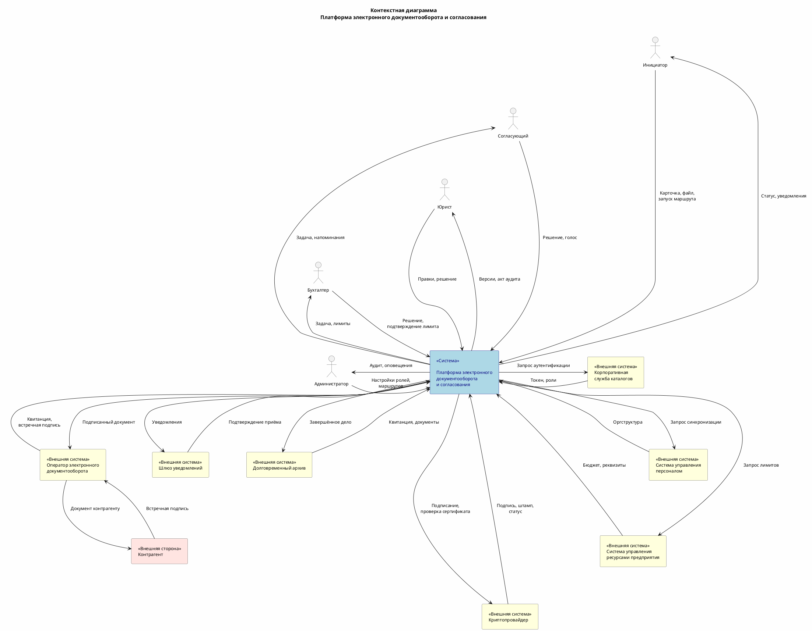

## 1. Контекст и границы

### 1.1 Описание системы

**Название:** Платформа электронного документооборота и согласования.

**Назначение:**
Платформа предназначена для автоматизации полного жизненного цикла
внутренних и внешних документов организации — от создания и согласования
до подписания электронной подписью, обмена с контрагентами и передачи
в долговременный архив.

Платформа заменяет бумажный документооборот и разрозненные инструменты
(электронная почта, общие сетевые папки, ручные журналы) единой системой
с контролем версий, юридически значимыми подписями, прозрачным
аудиторским следом и автоматической маршрутизацией задач.

**Типы обрабатываемых документов:**

- Договоры с контрагентами
- Служебные записки
- Заявки на оплату
- Политики и положения (стратегические документы)
- Иные внутренние документы, требующие согласования

**Цель системы (миссия):**

Обеспечить прозрачное, контролируемое и юридически значимое прохождение
документов от момента создания до архивации — так, чтобы:

1. Каждый участник маршрута согласования видел актуальный статус документа,
   историю версий и принятые решения.
2. Сроки согласования контролировались автоматически с эскалацией
   просроченных задач.
3. Электронные подписи (Квалифицированная Электронная Подпись и Усиленная
   Неквалифицированная Электронная Подпись) обеспечивали юридическую
   значимость документов.
4. Обмен документами с контрагентами происходил через оператора
   электронного документооборота с встречной подписью.
5. Неизменяемый аудиторский след позволял восстановить полную картину
   событий при проверке или судебном споре.
6. Система продолжала работать при временной недоступности внешних систем
   в режиме деградации с последующей синхронизацией.
7. Сотрудники могли согласовывать срочные документы с мобильных устройств
   вне офиса.

---

### 1.2 Границы системы

**Входит в границы платформы:**

- Создание, хранение и версионирование карточек документов и файлов
- Маршрутизация задач согласования (последовательная и параллельная)
- Наложение и проверка электронных подписей
- Контроль сроков согласования, напоминания и эскалация
- Коллегиальное согласование с агрегацией голосов
- Проверка бюджетных лимитов при заявках на оплату
- Формирование неизменяемого журнала аудита
- Отправка и приём документов через оператора электронного документооборота
- Передача завершённых дел в долговременный архив
- Мобильный интерфейс для просмотра и согласования
- Управление ролями, шаблонами маршрутов и справочниками

**Не входит в границы платформы (внешние системы):**

- Хранение учётных записей сотрудников — корпоративная служба каталогов
- Ведение кадровой структуры — система управления персоналом
- Бюджетирование и бухгалтерский учёт — система управления ресурсами
  предприятия
- Удостоверяющий центр и криптографические операции — криптопровайдер
- Юридически значимая доставка документов контрагентам — внешний оператор
  электронного документооборота
- Физическая доставка уведомлений — внешний шлюз уведомлений
- Долговременное хранение (5 и более лет) — внешний долговременный архив
- Ведение справочника контрагентов — система управления ресурсами
  предприятия / клиентская база

---

### 1.3 Внешние сущности и потоки данных

#### Пользователи (роли)

| Внешняя сущность | Направление | Данные / события |
|---|---|---|
| **Инициатор** | → Платформа | Карточка документа (реквизиты, файл), запуск маршрута, загрузка новой версии, повторная отправка после доработки |
| **Инициатор** | ← Платформа | Статус документа, уведомления о согласовании / отклонении / подписании, протокол голосования |
| **Согласующий** | → Платформа | Решение (согласовать / отклонить / делегировать), голос (за / против / воздержался), комментарий, загрузка версии |
| **Согласующий** | ← Платформа | Задача на согласование (документ, версии, комментарии предыдущих участников), напоминания, результат голосования |
| **Юрист** | → Платформа | Правки документа (новая версия с комментарием), решение (согласовать / отклонить), запрос акта аудита |
| **Юрист** | ← Платформа | Задача на проверку, история версий, результат проверки подписи, акт аудита в формате переносимого документа |
| **Бухгалтер** | → Платформа | Решение по заявке (исполнить / отклонить), ручное подтверждение лимита |
| **Бухгалтер** | ← Платформа | Задача с реквизитами контрагента и информацией о лимитах, пометка «Проверить лимиты вручную» |
| **Администратор** | → Платформа | Настройка маршрутов, шаблонов, ролей, прав доступа, ручная аутентификация пользователей |
| **Администратор** | ← Платформа | Журнал аудита, статус внешних систем, отчёт по уровню сервиса, оповещения о нарушении целостности |
| **Контрагент** | → Платформа (через оператора электронного документооборота) | Встречная Квалифицированная Электронная Подпись, протокол разногласий |
| **Контрагент** | ← Платформа (через оператора электронного документооборота) | Подписанный документ |

#### Внешние системы

| Внешняя сущность | Направление | Данные / события |
|---|---|---|
| **Корпоративная служба каталогов** | → Платформа | Результат проверки учётных данных (успех / отказ), роли, группы пользователя |
| **Корпоративная служба каталогов** | ← Платформа | Запрос на проверку учётных данных при входе пользователя |
| **Система управления персоналом** | → Платформа | Данные сотрудников, ролей, иерархии, замещений (периодическая синхронизация) |
| **Система управления персоналом** | ← Платформа | Запрос на синхронизацию справочника организационной структуры |
| **Система управления ресурсами предприятия** | → Платформа | Остаток бюджета по статье расходов, лимит договора, статус и реквизиты контрагента |
| **Система управления ресурсами предприятия** | ← Платформа | Запрос на проверку лимитов, запрос статуса контрагента, команда на списание суммы из лимита |
| **Криптопровайдер** | → Платформа | Подписанная контрольная сумма, штамп времени, результат проверки статуса сертификата (действителен / отозван / истёк) |
| **Криптопровайдер** | ← Платформа | Контрольная сумма файла для подписания, запрос на проверку статуса сертификата |
| **Оператор электронного документооборота** | → Платформа | Квитанция об отправке, подписанный контрагентом экземпляр, протокол разногласий |
| **Оператор электронного документооборота** | ← Платформа | Подписанный документ для отправки контрагенту |
| **Шлюз уведомлений** | → Платформа | Подтверждение приёма уведомления шлюзом |
| **Шлюз уведомлений** | ← Платформа | Уведомления (электронная почта, push-уведомления, короткие текстовые сообщения) |
| **Долговременный архив** | → Платформа | Квитанция о приёме дела (идентификатор дела, контрольная сумма), запрашиваемые архивные документы |
| **Долговременный архив** | ← Платформа | Завершённое дело (файлы всех версий, подписи, метаданные карточки, лента аудита), запрос на извлечение документа |

---

### 1.4 Контекстная диаграмма

---

### 1.5 Ключевые ограничения и допущения

**Ограничения:**

1. Платформа не является системой долговременного хранения —
   ответственность за обеспечение сроков хранения (5 и более лет)
   несёт внешний Долговременный архив.
2. Платформа не выпускает сертификаты электронной подписи —
   все криптографические операции выполняются через внешний
   криптопровайдер (удостоверяющий центр).
3. Платформа не ведёт справочник контрагентов — реквизиты и статус
   контрагентов запрашиваются из системы управления ресурсами
   предприятия.
4. Платформа не осуществляет прямую доставку электронной почты,
   push-уведомлений и коротких текстовых сообщений — используется
   внешний шлюз уведомлений.
5. Физическая доставка документа контрагенту осуществляется через
   внешнего оператора электронного документооборота — платформа
   отвечает за формирование и передачу документа оператору.

**Допущения:**

1. Корпоративная служба каталогов содержит актуальные учётные записи
   всех сотрудников организации.
2. Система управления персоналом отражает текущую организационную
   структуру, включая замещения.
3. Криптопровайдер поддерживает протокол онлайн-проверки статуса
   сертификата и выдачу штампов времени.
4. Оператор электронного документооборота обеспечивает роуминг
   с операторами контрагентов.
5. Внешний шлюз уведомлений поддерживает отправку по электронной почте,
   push-уведомлений и коротких текстовых сообщений.
6. Долговременный архив обеспечивает сохранность данных в течение
   установленного срока и поддерживает извлечение по идентификатору дела.
